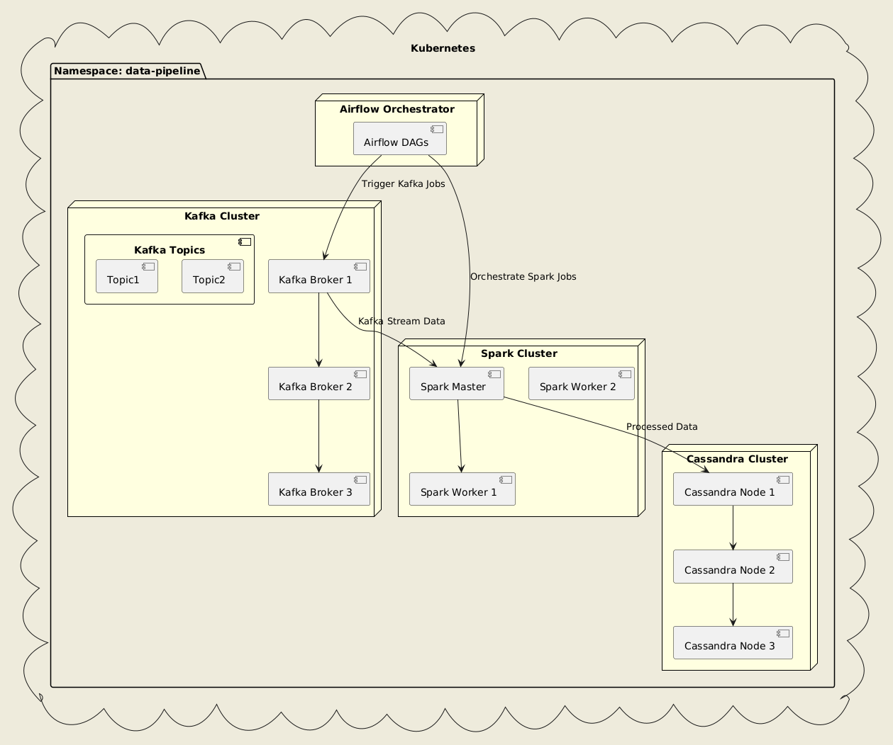

# Projet : Examen de Base de Données (dit-db-exam)

## Contexte et Objectif
Ce projet est développé dans le cadre d'un examen de base de données. Il met en œuvre un pipeline de traitement de données sur Kubernetes, utilisant les technologies de pointe pour démontrer la gestion, l’ingestion, le traitement et le stockage de données en environnement distribué. 



### **Introduction**
Ce projet met en œuvre un pipeline de traitement de données en temps réel capable de générer des données fictives de personnes à l'aide du package Python **`faker`** et de les envoyer à **Apache Kafka**. Le processus d'envoi est orchestré par **Apache Airflow**. Les données sont ensuite consommées par **Spark Structured Streaming** et écrites dans la base de données **Apache Cassandra**. Tous les services sont déployés et gérés sur un environnement **Kubernetes**.

### **Stack Technologique**
- **Langage** : Python
- **Orchestration** : Apache Airflow
- **Messagerie** : Apache Kafka
- **Traitement de Données** : Apache Spark
- **Stockage de Données** : Apache Cassandra
- **Environnement de Déploiement** : Kubernetes

### **Structure du Projet**
1. **Génération de Données** : Utilisation de `faker` pour générer des données synthétiques (nom, prénom, adresse, email, etc.) et envoi vers un topic Kafka.
2. **Orchestration des Données** : Les DAGs d'Airflow gèrent la planification et l'exécution des tâches de génération de données.
3. **Streaming de Données** : Spark Structured Streaming consomme les messages des topics Kafka en temps réel, traite les données et les envoie vers Cassandra.
4. **Stockage de Données** : Les données structurées et traitées sont ensuite stockées dans Cassandra, prêtes à être consultées ou analysées par des applications en aval.

### **Instructions de Déploiement sur Kubernetes**

#### **1. Prérequis**
- **Un cluster Kubernetes** (local ou sur le cloud).
- `kubectl` installé et configuré pour interagir avec le cluster.
- Helm (optionnel) pour la gestion des applications Kubernetes.
- Accès à Docker pour construire les images personnalisées (Airflow, Spark).

#### **2. Création d’un Namespace**
Créez d'abord un namespace dédié à ce projet :

```bash
kubectl apply -f config/namespace.yaml
```

Puis, appliquez les ressources suivantes pour configurer les rôles et les droits d'accès nécessaires :

```bash
kubectl apply -f config/data-pipeline-role.yaml
kubectl apply -f config/data-pipeline-rolebinding.yaml


kubectl apply -f config/local-path-storage.yaml
kubectl apply -f config/pvc.yaml
```

Vérifiez l'état des pods système pour vous assurer que tous les composants sont en place :

```bash
kubectl get pods -n kube-system
```

Cela créera un namespace `data-pipeline` où tous les services seront exécutés de manière isolée.

#### **3. Déploiement de PostgreSQL et Redis**
Déployez les services PostgreSQL et Redis requis pour stocker les métadonnées et la queue des tâches Airflow :

```bash
## On the workers : sudo chown -R 999:999 /mnt/data/postgres && sudo chmod -R 700 /mnt/data/postgres


kubectl apply -f deployment/postgres.yaml
kubectl apply -f deployment/redis.yaml
```

#### **4. Déploiement de Airflow**
Créez et déployez l'image Docker personnalisée d'Airflow :

```bash
docker build -t barryma22/airflow:2.4.2-python3.10 -f src/airflow/airflow.Dockerfile src/airflow
```

Déployez ensuite les composants d'Airflow (Webserver, Scheduler, Worker) :

```bash
kubectl apply -f config/airflow-admin-serviceaccount.yaml

## On the workers :
sudo mkdir -p /mnt/data/airflow-dags
sudo mkdir -p /mnt/data/airflow-logs
sudo chown -R 50000:50000 /mnt/data/airflow-logs
sudo chmod -R 775 /mnt/data/airflow-logs
sudo chown -R 50000:50000 /mnt/data/airflow-dags
sudo chmod -R 775 /mnt/data/airflow-dags

kubectl apply -f deployment/airflow.yaml
```

Créez une **ConfigMap** pour injecter les scripts nécessaires dans le conteneur d'Airflow :

```bash
kubectl create configmap airflow-scripts --from-file=/home/barryma/Workspace/tasks/kubernetes/examen-db/src/airflow/scripts/ --namespace data-pipeline
kubectl apply -f src/airflow-scripts-copy-job.yaml
```

Assurez-vous que tous les pods sont en cours d'exécution :

```bash
kubectl get pods -n data-pipeline
```

Une fois Airflow déployé, accédez au webserver Airflow :

```bash
kubectl port-forward svc/airflow-webserver 8080:8080 -n data-pipeline
```

Ouvrez [http://localhost:8080](http://localhost:8080) pour accéder à l'interface utilisateur.

#### **5. Déploiement de Zookeeper et Kafka**
Déployez Zookeeper et Kafka :

```bash
kubectl apply -f deployment/kafka-zookeeper.yaml
```

#### **6. Déploiement de Spark Master et Workers**
Déployez le Spark Master et les Workers :

```bash
kubectl apply -f deployment/spark.yaml
```

Vérifiez que l'interface Spark UI est accessible :

```bash
kubectl port-forward svc/spark-master 8080:8080 -n data-pipeline
```

Accédez à [http://localhost:8080](http://localhost:8080) pour vérifier l'état des workers.

#### **7. Déploiement de Cassandra**
Déployez la base de données Cassandra :

```bash
kubectl apply -f deployment/cassandra.yaml
```

#### **8. Vérification de la Configuration**
- **Airflow DAGs** : Vérifiez que les DAGs s'exécutent correctement dans Airflow.
- **Kafka** : Produisez et consommez des messages depuis les topics Kafka.
- **Spark** : Assurez-vous que Spark peut lire les données de Kafka et écrire dans Cassandra.
- **Cassandra** : Vérifiez que les données sont correctement enregistrées.

#### **9. Démonstration : Exécution Étape par Étape**

- **Étape 1** : Créer un job Kubernetes pour copier le script Spark :

```bash
kubectl create configmap spark-script-config --from-file=src/scripts/spark_streaming.py --namespace data-pipeline
kubectl apply -f src/spark-script-copy-job.yaml
```

- **Étape 2** : Créer un job Kubernetes pour configurer le schéma Cassandra :

```bash
kubectl apply -f src/cassandra-schema-setup-job.yaml
```

- **Étape 3** : Créer un job Kubernetes pour soumettre le job Spark :

```bash
docker build -t barryma22/spark-k8s -f src/spark/spark.Dockerfile src/spark
docker push barryma22/spark-k8s
kubectl apply -f src/spark-submit-job.yaml
```

- **Étape 4** : Automatiser l'exécution avec un CronJob Kubernetes :

```bash
./launch-spark-job.sh
```

#### **10. Nettoyage**
Pour nettoyer l'ensemble du projet :

```bash
kubectl delete namespace data-pipeline
```
